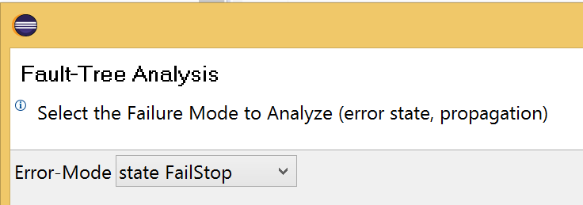
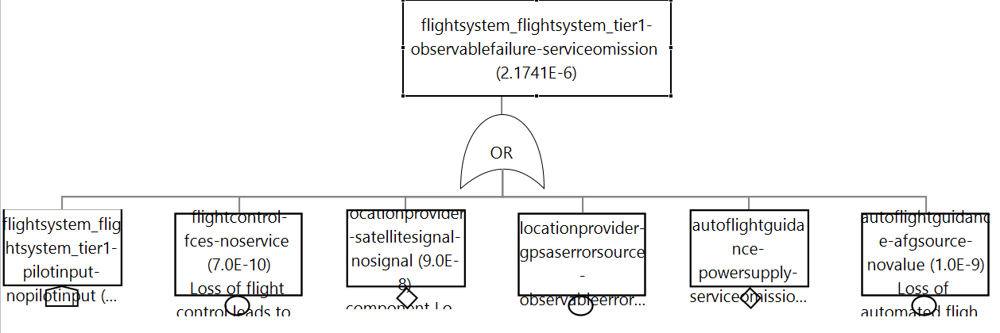
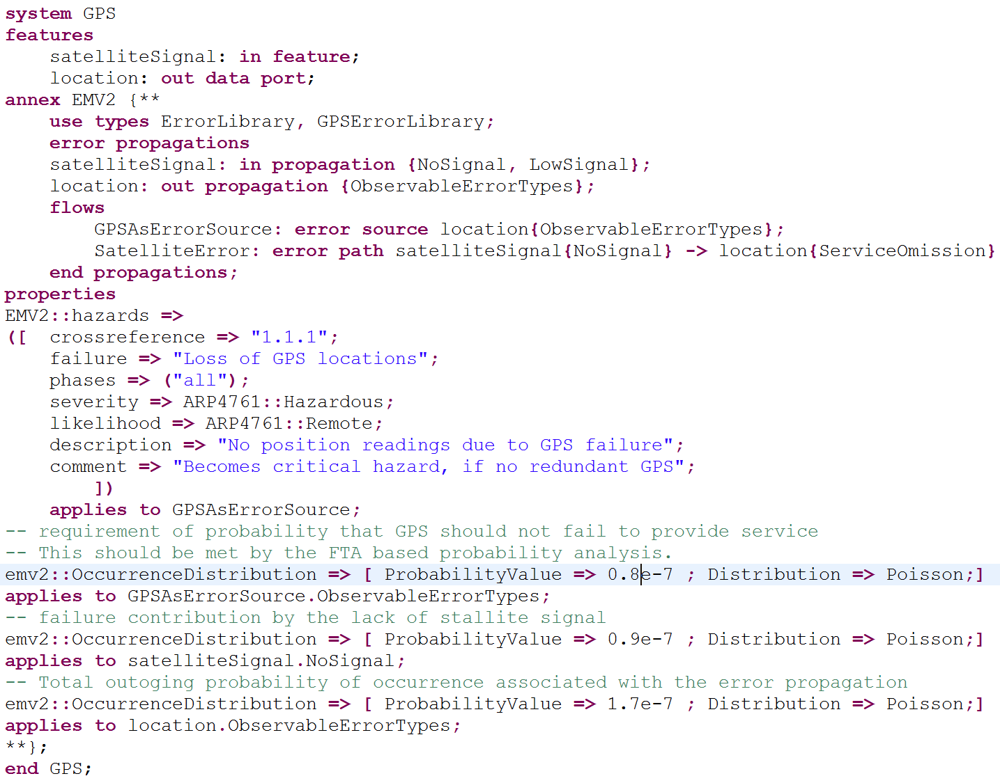
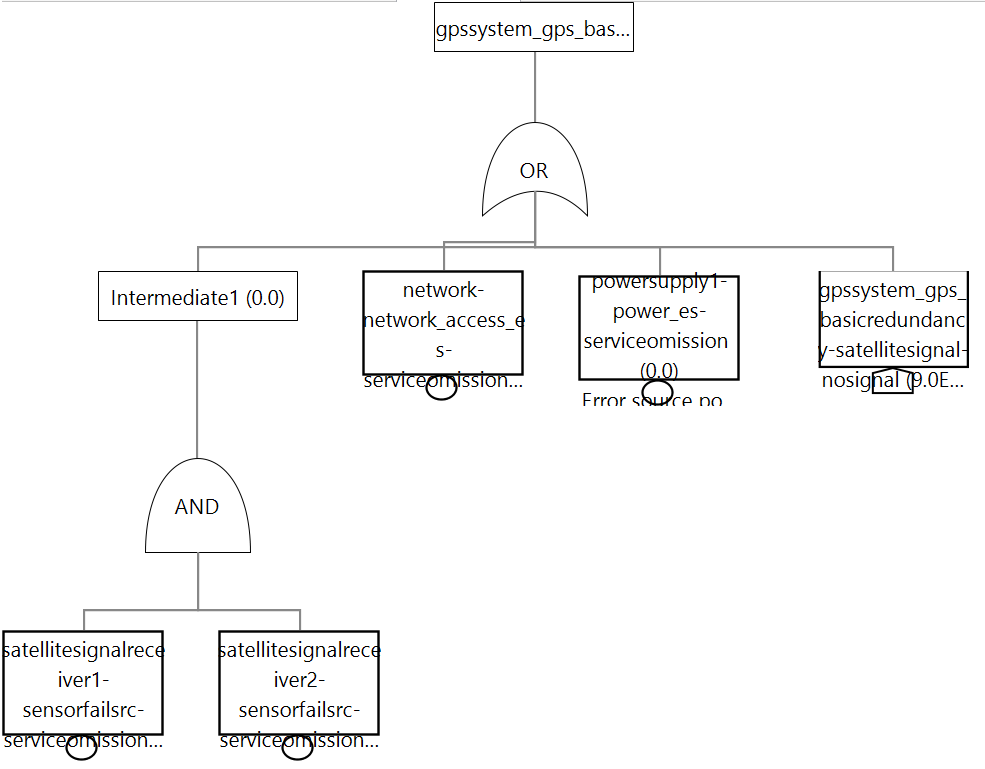
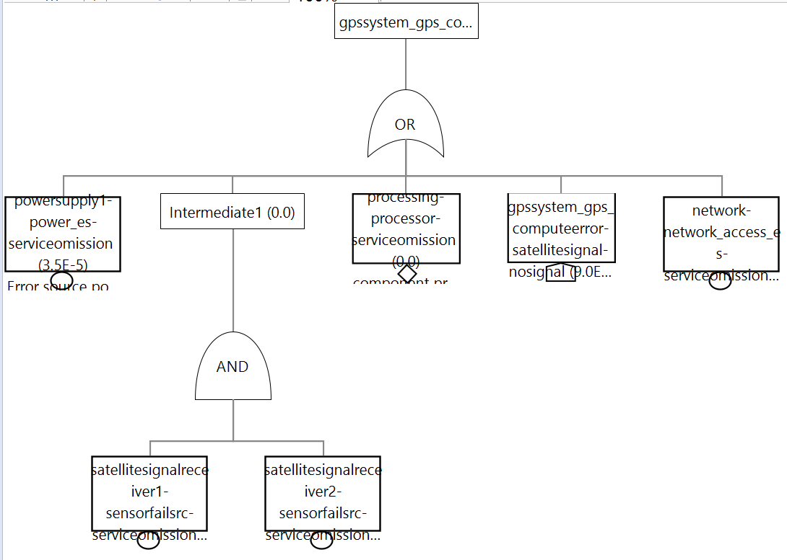
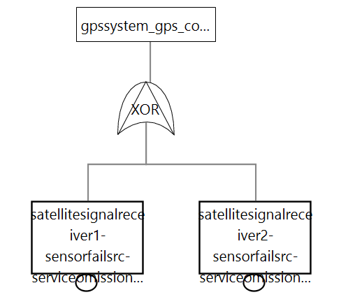
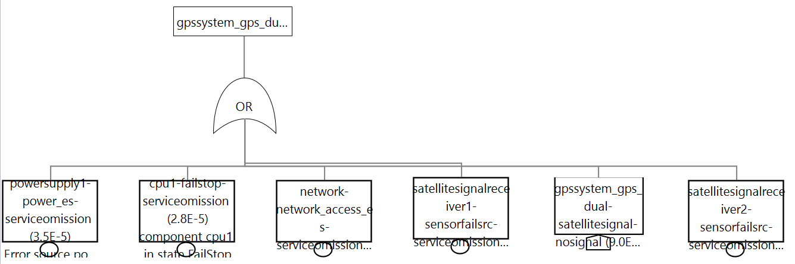

# Inductive and Deductive Fault Impact Analysis

## Introduction
In this write-up, we demonstrate on an example how architecture-led inductive and deductive fault impact analysis of a safety-critical system can be performed incrementally through the use of AADL, Error Model V2 (EMV2), and the analysis capabilities of OSATE. In particular we are highlighting recent enhancements to the safety analysis capabilities. 

The model example is available on Github as [Safety Tutorial](https://github.com/osate/examples/tree/master/SafetyTutorial).

In inductive fault impact analysis the impact of fault occurrences on a system is determined through forward reasoning from an error source. One such form of inductive impact analysis is known as failure mode and effect analysis (FMEA). In OSATE it is supported by a Fault Impact Analysis (FIA) capability, found in the AADL Analyses/Fault Analyses menu.

In deductive fault impact analysis fault occurrences are identified as contributors to a critical failure effect, such as an accident through backward reasoning. One such form of deductive fault impact analysis is known as fault tree analysis (FTA). In OSATE it is supported by an EMF-based Fault Tree Analysis (EMFTA) capability. This capability uses an EMF-based fault tree representation (file extension emfta) that supports event and gate types defined in the NRC Fault Tree Handbook (NUREG-0492). In addition, it supports shared event/gate subtrees to represent dependent events, i.e., shared resources and components as common source of failure.

The EMFTA capability consists of an EMFTA generator and a graphical EMFTA editor that can also be used as a stand-alone Eclipse plug-in independent of OSATE. The editor lets users create fault trees interactively or open generated emfta files, compute minimal cut sets, and calculate failure probabilities.

Risk-based system safety analysis assesses the risk of different failure leading to undesirable effects by assigning likelihood of occurrence of failure events and severity of impact. Typically, qualitative values are assigned with quantitative numbers associated with them. The EMFTA generator includes such probabilities assigned in EMV2 in the generated fault tree.

We will show how AADL and EMV2 can be used in this process. In terms of notation, we will demonstrate the use of EMV2 at three levels of abstraction:

 1. error propagations and flows: early for FHA, forward impact analysis (FMEA) typically single source to identify impact; backward propagation to identify all potential contributors to a catastrophic or major event (in FTA format); common cause analysis to identify shared resources or functions (CMA/CCA). This level does not take into account any safety system/fault management design. The level of specification detail corresponds to that of the Fault Propagation and Transformation Calculus (FPTA) of York University.
 2. Component error behavior specifications: identification of failure modes, Types of component failures (error events), error behavior logic to reflect redundancy of external input and redundancy of subcomponents.
 3. Compositional error behavior in terms of subcomponent behavior to determine initial system reliability based on a parts model, and to identify the starting point for a deductive fault impact analysis of safety systems.

We will demonstrate the capability on a GPS system. First, we introduce the GPS in the context of its operational setting, a flight system. Given the safety requirements of the flight system we determine a safety requirement on the GPS in terms of likelihood of failure. We do so on a functional architecture of the flight system. This becomes basis for the design process of the GPS. Initially, a system engineer determines the functional architecture and the physical architecture of the GPS. For the physical architecture, the system engineer identifies physical components and assesses whether they are able to achieve the required failure occurrence probability. Design alternatives are considered to see if the target probability can be achieved, or whether the architect of the flight system has to accommodate a lower reliability GPS. The functional architecture determines the data and control flow it becomes the basis for inductive and deductive fault impact analysis. Once allocation decisions have been made, the impact of physical component faults on the services provided are analyzed.

We proceed by first providing a summary of fault impact analysis and fault tree analysis, and then walking through a series of development phases to illustrate the use of these analyses on models with different levels of detail.

# The Analysis Capabilities
In this section we summarize the fault impact analysis, two forms of fault contributor analysis (state-based and flow-based) both represented by emfta fault trees, and the mapping of AADL and EMV2 specifications into fault tree events and gates.

## The Fault Impact Analysis
The fault impact analysis (FIA) works with AADL models annotated with EMV2 at various levels of detail. At a minimum, users have to specify outgoing and incoming error propagations. Users specify both error types to be propagated and error types not to be propagated. OSATE will ensure that the assumed incoming propagated error types match up with those that are propagated from other components.

Once users add error source, error path and error sink declarations, FIA can do its job. FIA starts with each error source and the **when** condition associated with it. The element of the condition become the original fault and the out propagation identified by the error source the first level effect. For each component the outgoing propagations follow the connections or bindings to their destination component until an error sink, an outgoing error propagation external to the outermost system, or a cycle in the propagation are detected. For each incoming propagation error paths are used to identify outgoing propagations. If not error paths are specified all outgoing propagations are assumed to be affected by an incoming propagation
.
The FIA report also includes propagations from external sources, i.e., from any incoming propagation declaration of the outermost system.

Note that the EMV2 specifications use error types. The impact analysis is performed on a per type basis. If the original source has an error type with subtypes or an error type set it is propagated until subsequent steps include constraints that take subsets. Error paths may perform type transformation.

Users can associate EMV2 specifications at several levels of a system architecture. When an instance model has been created the propagation dependency graph that is used for the FIA as well as the FCA is determined by the lowest level interconnected and bound components that have EMV2 subclauses.

When user add component error behavior, i.e., error events, error states, and transitions, they are interpreted as part of the FIA, giving the user a higher fidelity FIA result.

## EMF-based Fault Tree Analysis (EMFTA)

Fault contributor analysis operates with the same AADL model annotated with EMV2. Again users can specify the model at different levels of detail. Users can specify error propagations and error flows as for FIA and have the analysis start with a target system state or outgoing propagation of the top-level system. In this case, the propagation paths in the propagation graph are traversed backward to construct a fault tree representation.

### State-based EMFTA

One use early in the process is a state-based EMFTA. In this case users define a parts model, i.e., identify the parts of each system, and specify how the error states of the parts relate to the error states of the enclosing system through composite state declarations. Note that user can define such a model with error state machines at multiple level of a system architecture. Users also do not have to specify an error state machine for each level. Instead a higher level state can be expressed in terms of subsystems more than one level down.

In our example, the package *GPSSystem* contains the top level GPS system with a number of implementations with different levels of detail and configurations. The parts model is represented by the system implementation *gps.parts_SingleSensor*. In this case, the EMFTA constructs a complete system fault tree form fault tree fragments based on the composite state declarations for a user-selected error state of the top-level system.

The resulting fault tree can then be analyzed for cut sets, i.e., shortest path to cause the root node of the tree to fail, and occurrence probability based on occurrence probabilities of the leaf nodes, i.e., the error states of the leaf components with EMV2 subclauses. The EMFTA tool also includes consistency checks to determine that the model has been consistently annotated with fault occurrence probabilities.

Probabilistic state-based EMFTA is performed by using occurrence distribution specifications or error states. This allows for the use of an error state machine without having a full specification of error transitions and outgoing propagation conditions. If an error state machine has been included with error events and transitions, then the state probability may be derived from the error event probabilities and the transition condition logic.

Note that a composite propagation declaration may include references to incoming error propagations. This allows users to specify external impact on a system by identifying the incoming error propagations with the appropriate logic statements for the top-level system, e.g., the impact of satellite signal failure.

### Flow-based EMFTA

Flow-based EMFTA utilizes error flows and propagation paths as well as component error behavior specifications. In its simplest form EMFTA traces back from a user identified outgoing error propagation and error type of interest for the top-level system. In our example, this is represented by the top-level system implementation gps.basic.

This propagation represents the external effect a system function or service can have on its operational environment. The backward trace continues until it encounters an error source, or an incoming error propagation that does not have a propagation path due to an absent connection or binding. An example of an intentionally unconnected incoming error propagation is an incoming propagation of the top level system. An example is shown in the figure below for the satellite signal coming to the satellitesignalreceiver.

The resulting fault tree is flattened during the generation. For example, the error source contributions of three successive components are represented as Events under a single OR gate instead of a right recursive tree of binary OR operators. Flattening has the effect that components may not show if they do not have fault contributors. For example, a software component itself may not show as contributor, if no error source or event has been specified for it, but the processor the software component is bound will show as contributor – illustrated in the example above by the event named Processing_processor_serviceomission
Some components may be included multiple times in a fault tree. For example, a single source component whose output is fanned out along multiple paths and then brought together, or a processor with multiple software components bound to it. Such components are actually a single instance that is linked to by multiple gates in the fault tree. If the same component occurs multiple times directly under a gate it is listed only once. In our example above, the power supply is such a component.

## EMV2 and Fault Tree Logic

The [EMFTA Editor](https://github.com/cmu-sei/emfta) supports creation of fault trees interactive. It works with files of the extension emfta. It supports the following fault tree Event types and Gate types.
Events: Basic, External, Intermediate, Undeveloped, and Conditioning.
We make use of Basic to represent leaf Events in the tree, External to represent Events that come from outside the system of interest, Intermediate to represent any composite Event, and Undeveloped to represent binding points for which have not been specified yet.

Gates: OR, AND, XOR, PRIORITY_AND, INTERMEDIATE.

We make use of OR, AND, XOR for the intended logic, INTERMEDIATE when there is a single Event, e.g., only one Event leading to the fault tree root, PRIORITY_AND when event ordering is important, e.g., one error event getting us to one error state and a second error event getting us to the error state of interest.

### Mapping of EMV2 Constructs into Fault Tree Elements
The EMFTA generator maps EMV2 constructs into fault tree Events and Gates as follows:
 * EMV2 conditions have AND, OR, ORMORE, ALL as logical operators
  * AND maps to EMFTA AND
  * OR maps to EMFTA XOR (Note we will have an errata on EMV2 to allow XOR as keyword)
  * 1 ORMORE maps into EMFTA OR
  * X ORMORE will map into a voting k of n gate or translated into appropriate combinations of EMFTA XOR and AND gate combinations (not supported yet)
  * ALL maps into EMTFA AND

In the case of state-based EMFTA, the condition logic of composite error state declarations are reflected according to the above mapping. For each subcomponent state its composite state declaration is interpreted if present. Otherwise, the state is traced to the error events that trigger transition into the state by interpreting the transition conditions that lead to the error state (OR of multiple transitions), and recursively transitions triggered by error events leading to those states (PRIORITY_AND of multiple transitions). Error events are BASIC events. If the model does not include transitions triggered by error events that lead to the error state, the state itself is shown as BASIC event.

In the case of flow-based EMFTA, an outgoing error propagation is the starting point. We follow backwards OutgoingPropagationConditions (OPC) with multiple OPCs combined as OR.

If OPCs are absent, we follow error flow declarations. When following error flows, we combine error paths and error sources as OR.

For OPC, the condition expression and the error state are interpreted and combined as a PRIORITY_AND with the state related event occurring before the trigger condition). If the outgoing propagation condition applies to all states (all keyword on left) only the condition is interpreted.

The OPC condition, if not empty, identifies incoming error propagations. They are followed to outgoing propagations of connected/bound components by following propagation paths. Multiple paths are combined as an OR.

From the error state of the OPC we track backwards via transitions to identify the error events leading to the state (details presented above), or any propagation (incoming from the enclosing component or outgoing from a subcomponent).

Error events and error sources are BASIC events. Incoming propagation that represent bindings, but are not bound, are represented by UNDEVELOPED events. Similarly, incoming propagations that do not have a propagation path to a sending component are UNDEVELOPED events.

Note that as we track backwards, we start with the error type identified by the user and perform the appropriate filtering and mappings according to the specified type set constraints. Incoming propagations that trace back to an incoming propagation of the top system, are represented by EXTERNAL events.

### Fault Tree Transformations

We flatten nested OR, XOR, AND, PRIORITYAND in the generated EMFTA tree (Idempotent Law). For example, if an OR gate has events that themselves contain OR gates, we move their events into the upper OR. The effect is that although the backwards trace traverses multiple components, if all are based on an OR, the events contributed by each component are placed under a single OR gate instead of a right recursively nested OR structure.

When creating the EMFTA structure, we identify dependent events, e.g., events that represent shared hardware components that multiple functional or software components are bound to, or a power supply that is physically connected to (supplies) multiple sensors. A single instance of this event is maintained in the EMFTA representation with multiple gates pointing to this instance instead of replicating it. A reference count greater than one on the shared event indicates that it is referenced by more than one gate. This effectively represents a directed graph. This allows for simple identification of common cause events.

We apply transformations to move the shared event up towards the root. In particular we apply the Law of Absorption to remove subgates with dependent events if they also exist as directly under the enclosing gate. We also apply the Distributive Law to move dependent events found in multiple subgates to the enclosing gate.

When users invoke the generate EMFTA command (found under Fault Analyses as EMFTA Export), they select a state or outgoing propagation of the top-level system as the root of the fault tree. By default the transformations are automatically applied. If the user wants to see the fault tree without optimizations and dependent events shown as separate copies in various subtrees, they can set a check Full tree in the dialog box of the command.
The fault tree is automatically opened in the graphical emfta editor when generated. Users can also open the [graphical emfta editor as explained here](https://github.com/cmu-sei/emfta)

# The GPS and its Operational Environment
In this section we examine the GPS system in its operational context and derive fault occurrence requirements.

The AADL model consists of two EMV2 error libraries (AFGErrorLibrary and GPSErrorLibrary), the HardwareParts package with hardware platform components, the GPSParts package with the sensor device and GPSProcessing function, the GPSSystem package with the specification and various implementations of the GPS system that we will instantiate for analysis. In addition we have the packages FlightControl and AutomatedFlightGuidance defining other subsystems, and the FlightSystem package with a flight system whose implementation defines the operational context of the GPS, i.e., its interactions with flight control and automated flight guidance. Three flight system implementations with different levels of detail are provided.

## The GPS System and its External Interface

The GPS is shown as a location provider in the functional architecture of the flight system. Other functions of the flight system are an automated flight guidance service and a flight control service that manipulates the flight surfaces. The flight system itself has a target probability of failure (likelihood) as a safety requirement, which was derived from an aircraft level system safety assessment. Similarly, severity and likelihood levels are assigned to the three functions the flight system utilizes.

The AADL specification of the flight system uses an abstract feature to represent an observable failure point of the flight system.  The flight system also accepts input from the pilot. The specification indicates observable failure in the form of service omission and erratic control of the flight surfaces. The pilot may not provide input when expected or erratic input due to external circumstances.

The required (target) occurrence probability is shown as property on the error source declaration, indicating that this is the occurrence probability contributed by the flight system. The total probability of the flight system not providing service also takes into account assumed probability of pilot error.

~~~
system FlightSystem
features
  pilotInput: in data port;
  ObservableFailure: out feature;
annex EMV2 {**
use types ErrorLibrary, AFGErrorLibrary,GPSErrorLibrary;
error propagations
  pilotInput: in propagation {NoPilotInput, ErraticPilotInput};
  ObservableFailure: out propagation {ServiceOmission, ErraticBehavior};
flows
  NoFlightSystem: error source ObservableFailure{ServiceOmission} when {FlightSystemfailure};
  ErraticFlightSystem: error source ObservableFailure{ErraticBehavior};
  ErraticPilot: error path pilotInput{ErraticPilotInput} -> ObservableFailure{ErraticBehavior};
  NoPilot: error path pilotInput{NoPilotInput} -> ObservableFailure{ServiceOmission};
end propagations;
properties
-- requirement that flight system should not fail to provide service
  emv2::OccurrenceDistribution => [ ProbabilityValue => 2.5e-9 ; Distribution => Poisson;]
	applies to ObservableFailure.ServiceOmission;
-- a requirement that GPS should only operate erratically
  emv2::OccurrenceDistribution => [ ProbabilityValue => 2.0e-4 ; Distribution => Poisson;]
	applies to ObservableFailure.ErraticBehavior;
-- assumed probability of pilot error
  emv2::OccurrenceDistribution => [ ProbabilityValue => 2.0e-6 ; Distribution => Poisson;]
	applies to pilotInput.ServiceOmission;
  emv2::OccurrenceDistribution => [ ProbabilityValue => 7.0e-6 ; Distribution => Poisson;]
	applies to pilotInput.ErraticPilotInput;
 **};
end FlightSystem;
~~~

The following figure shows the functional flight system architecture.  It is declared in the AADL model as a tier1 architecture (FlightSystem.Tier1). Note that AutoFlightGuidance has an interface to a power supply that has not been connected. However, in the AADL specification, we can indicate the expected power requirements as well as expected failure rates.

The components of the flight guidance system have been annotated with hazard information to reflect a functional hazard assessment at this aircraft subsystem level. Hazard information is associated with the error sources of each subsystem using an EMV2 property. Users can execute a FHA command to generate a FHA report. This is done by instantiating FlightSystem.Tier1 and selecting the file containing the generated system instance (found in the instances folder), and invoking the Functional Hazard Assessment command in the Analyses/Fault Analyses menu. The resulting report is found in the reports folder under FHA.

Users can also determine the impact of the identified hazards through a fault impact analysis. In this case, a table is generated that traces a fault occurrence from its error sources through the error flows within components, as determined by error flow declarations, and by propagation paths between components as determined by AADL connection declarations. The Fault Impact Analysis command is also invoked on the selected instance model with the resulting report in reports/FaultImpact.

Users can determine all contributors to a flight system failure and assess whether the failure occurrence probabilities assigned to each subsystem and assumed by the context are sufficient to meet the maximum failure occurrence requirement for the flight system. Users can generate a fault tree by applying the EMFTA export command to the FlightSystem.Tier1 instance. Users identify ObservableFailure of error type ServiceOmission of FlightSystem as the fault tree root. The resulting fault tree is displayed in the graphical EMFTA tool. It shows all the contributors to the failure of the flight system. The graphical EMFTA tool also supports the computation of the occurrence probability for the system level failure as result of the failure probabilities of all the contributors by executing the command “Update probability” on the root object of the fault tree. The result is illustrated in the figure below.

## The GPS System Specification

The GPS provides location information based on signals received by a sensor, reflected in a system type specification shown in Figure 3. The specification include annotations that capture system requirements and assumptions including those about fault behavior.

These include requirements for service availability and assumptions about the availability of satellite signals. Using the EMV2 notation we associate error propagations and error flows to specify the GPS as an error source and the expected response of the GPS of failures in the satellite signals.

Note that the reliability requirement for the GPS is reflected by an occurrence probability on the error source declaration. This indicates the probability of failure to provide service by the GPS itself.

We also document the assumption about the occurrence probability of incoming error propagations from signal loss. Finally, we can document the expected total probability of no GPS service as [property on the outgoing error propagation. The OSATE analysis capability can then compute the failure probability of the GPS service and compare it against the specified value. The initial calculation is simply the addition of the error source and error path values.

# Early Physical System Analysis

## Initial Physical System Design

At this stage a system engineer can do a quick sketch of the GPS system as a physical system design. Initially, we focus on the GPS in terms of its parts. For that purpose the user defines an implementation of the GPS that consists of subcomponents that represent the physical parts. This is expressed in the system implementation GPS.parts_SingleSensor. Initially the GPS is specified to consist of a sensor to receive satellite signals, a processor to perform computations, a network to support communication, and a power supply local to the GPS.

Each of the parts has an EMV2 specification that includes failure occurrence probabilities associated with the physical components. For the parts model we include an error state machine through use behavior and associate an occurrence probability with the FailStop state.

For the GPS system implementation, the user adds an EMV2 specification to indicate how the parts are combined for the system to provide a service. In this case, all the parts are needed for the GPS to operate, as seen in the composite error state declaration in Figure 5. An inclusive or is expressed as 1 ormore (<list of subcomponents with Failed state>). In this case, we consider individual component failures as well as combinations of failures. An exclusive or would be expressed by the or operator.

~~~~~
composite error behavior
states
[1 ormore(SatelliteSignalReceiver1.FailStop , cpu.Failstop
 , network.FailStop , powersupply1.FailStop)]-> FailStop;
end composite;
~~~~~

## Analyzing the GPS Parts Model

Once we instantiate the GPS parts model, we can run FHA, FIA, EMFTA, and compute the probability of failure for GPS.

An FHA report only shows the hazard specified for the GPS as a whole.

The FIA shows no results since he have not added any connections a propagation paths.

We can generate an EMFTA fault tree with the GPS FailStop state as the root. In this case, the composite state logic is used to determine the structure of the fault tree. The resulting fault tree directly reflects the composite state logic. If we had specified multiple levels of a system architecture, the fault tree would be a composite of the fragments specified in composite state declarations at each layer of the architecture.

When we compute the fault occurrence probability on the fault tree, we can see that the higher occurrence probability of the sensor dominates the fault occurrence probability of the GPS. The figure exceeds the desired target.

## Transient and Persistent Faults in the Sensor

Note that a revised version of the Sensor specification has been provided. It takes into account transient errors, which is reflected in a transition specification with transition branches (see Figure 6). The first branch represents persistent failure to FailStop. The second branch loops back to the Operational state to indicate transient failure behavior.

We can configure this specification into our physical parts design – see the system implementation GPS.parts_SingleTransient. By analyzing this specification we can see whether this revised specification results in differences in the occurrence probability numbers. In this case, the error event probability is multiplied with the branch probability to go into the FailStop state.

~~~
component error behavior
transitions
-- We assume a 20% persistent sensor failure rate.
	FailureTransition: Operational -[Failure]->
(FailStop with 0.2, Operational with 0.8);
propagations
	SensorFailPropagation: FailStop -[]-> sensedData{ServiceOmission};
end component;
~~~

## Exploring Two Redundancy Options
We define an alternative design with two sensors (GPS.parts_TwoSensor) to assess if this is sufficient for reaching the target failure occurrence probability. This is done by adding a second sensor as a subcomponent to the GPS system implementation, and by changing the composite state declaration to specify the two sensor failure with an AND operator. This indicates that the two sensors are assumed to be operating redundantly and one sensor is sufficient for operation.

The fault occurrence probability of this redundant sensor design may be too close to the target values as we are early in the system design. Therefore, the architect of the flight system can quickly explore the an alternative flight system architecture with a dual GPS design (see FlightSystem.Dual for the details) and determine whether this alternative provides a better solution with respect to the target occurrence probability for the flight system.

Note that when considering architecture design alternative, architects may take into account other system characteristics, such as weight and electrical power consumption. By annotating the various physical part specifications in AADL with weight and electrical power properties we can support such analyses from the same AADL model.

# GPS Functional Architecture and Physical System Binding

## Initial GPS System Architecture

The functional aspect of the sensor is captured by the device type declaration. For GPS processing we introduce an abstract component GPSProcessing that takes input from two sensors and produces the location as output. Both sensors are supplied with power and both are connected to a network to communicate to the CPU.

Its component type specification includes error flow specifications: Two error paths from the sensors input to the location output. Since this function will be executed on the processor, we also define an error path from its processor binding point to the location output to indicate that a processor error affects sensor output. This configuration of the GPS system is GPS.Basic. Note that we have defined an outgoing error propagation condition for GPS.Basic as shown in the listing below. It identifies the subcomponent whose output is used as GPS location output as the propagation source. This will be the starting point for the EMFTA generation.

~~~
Component error behavior
-- mapping of GPS producing GPS output to the GPS out propagation
propagations
  FTANoServiceStart: all-[processing.location{ServiceOmission}]-> location{ServiceOmission};
end component;
~~~

In addition, we elaborate the specification of the hardware parts to include a mapping from an error state to an outgoing error propagation as shown .  This will result in the inclusion of the error event triggering a transition to FailStop and its probability in the generated fault tree. We have done so for the CPU and the network. In case of the power supply we have identified an error source. In this case the probability of the error source specification is included in the generated fault tree. This illustrates that the tool supports error behavior specifications of mixed fidelity.

~~~
component error behavior
propagations
	FailStop -[]-> bindings{ServiceOmission};
end component;
~~~

We can now perform both fault impact analysis and EMFTA. Fault Impact Analysis starts with each error source and traces the effect through forward propagation along error flows and propagation paths.  The propagation paths are represented by the connections. In our example, the error sources of the sensors, the power supply and the network are considered. The processor is not included as without a binding declaration there is no propagation path from the CPU to GPS processing.

EMFTA starts with an undesirable effect, in our case no service out propagation from the GPS location port, and traces backwards to identify all potential contributors along error flows and propagation paths between components.

We specify the undesirable effect as starting point for the generation of the EMFTE fault tree by identifying the out propagation as the starting point in a dialog box after invoking the EMFTA export command. From that out propagation point the analysis traces backwards along connections as propagation paths, error flows through components, and state transitions triggers, if provided. Bindings will be included as propagation path once specified by the user (see next section).

The resulting flow-based fault tree is presented graphically in the EMFTA tool (see figure below). The two instances of the sensor show up in the fault tree as an OR since the specification only includes error paths. The power supply and the network are included in the fault tree because the affect the performance of the sensors. The GPS processing unit itself is not shown as a contributor as the model does not include a specification of software as an error source. However, GPS processing is dependent on executing on a processor. This is indicated by an incoming error propagation point whose propagation path is not known until a deployment binding is specified (Undeveloped Event). In this case the fault tree event shows the expected incoming propagation with an expected occurrence probability that was specified with the incoming propagation.

Note that some components become contributors to more than one fault subtree. For example, the power supply contributes to the sensors, network, and CPU. In the fault tree this is reflected as a shared Event node that is linked to multiple gates. In our example in Figure 10 the original fault tree has been transformed such that all events are under a single OR gate and components such as the power supply or network affect both sensors and are shown only once under this gate.

In the next step we add a component behavior specification that indicates specific logic as to how redundant input in mapped to output for the processing unit (GPS.BasicRedundancy). We indicate that processing only fails to produce output if both inputs are missing (an AND operator in the outgoing propagation condition declaration). In a second variant (GPS.BasicState) the incoming sensor errors are mapped into an error state, and the outgoing propagation condition is determined by this state.

The generated EMFTA model from an instance of GPS.BasicRedundancy reflects the AND for both sensors needing to fail. In this case, the network, power, and satellite signal are shown once under the outer OR gate as result of the optimization to move events representing shared error sources up the fault tree (see Figure 12). The fault tree for an instance of GPS.BasicState is the same – as expected.

## Functional Architecture Bound to Physical Architecture

We add binding information to the model, i.e., the binding of the GPS processing function to the processor (see GPS.BasicBound).

As a result of this binding the FIA includes the processor as an error source for which the impact is assessed. In the case of the EMFTA the event representing the expected incoming propagation from the processor is replaced by a fault tree event that represents the error source of the CPU with the specified occurrence probability (see Figure 13).

# Computational Error in Functional GPS System Architecture

The next step is to refine the functional (application) architecture of the GPS to reflect the fact that computation error may occur. We also consider the effect of one failing sensor. This is reflected in GPSProcessing_ComputeError, which now generates NoService, IncorrectData, and LowPrecisionData as outgoing propagations.

We can now generate EMFTA files from the instance model of GPS.ComputeError for Location{NoService}, Location{LowPrecision}, and Location{IncorrectData).
Note that the fault tree can be generated for the specific error type of interest.

Note also, that in the case of low precision data, we have an XOR gate that only includes the two sensor failures (see Figure 13). Power or network failure affects both sensors, thus does not satisfy the XOR.

We also have a variant where the software function with compute errors is bound to the processor (GPS.CEBound).

# Redundant Processors within GPS System Architecture

The final GPS system configuration GPS.Dual consists of two processors and two copies of the GPS processing unit. The output of the processing units is fed to a voter. The processing units are bound to a processor each, while the voter is bound to one of the processors. The resulting fault tree is shown in Figure 14. Due to the fact that a single voter instance is bound to one processor (cpu1) only that processor is included in the fault tree. The other processor is eliminated according to the law of absorption.

